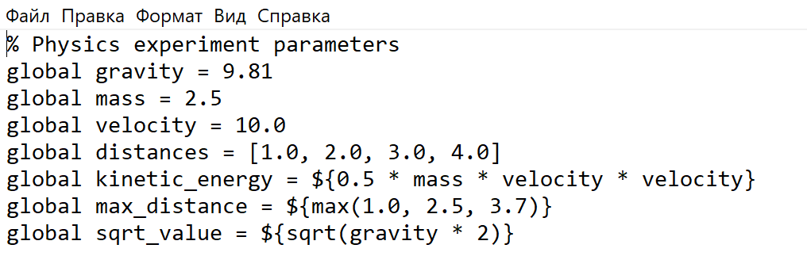

# conversion
## Конфигурационное управление. Домашняя работа

1. ОБЩЕЕ ОПИСАНИЕ
   
Вариант 24
Инструмент командной строки для преобразования текста на учебном конфигурационном языке в XML-формат. Реализация включает полный парсер языка с проверкой синтаксиса, вычислением выражений и генерацией структурированного XML.

Требования к языку:
- Однострочные комментарии: % Это комментарий
- Числа: Поддержка целых, дробных и экспоненциальных чисел
- Массивы: [значение значение ...]
- Имена переменных: [_a-zA-Z]+ (латинские буквы и подчеркивание)
- Строки: 'текст в кавычках'
- Объявление констант: global имя = значение
- Выражения: Инфиксные ${a + b * sqrt(c)}
- Операции: +, -, *, /, sqrt(), max()

Функциональность:
1) Чтение из файла (параметр --input)
2) Вывод XML в стандартный поток
3) Детектирование синтаксических ошибок
4) Вычисление константных выражений

2. ИСПОЛЬЗОВАНИЕ:
   
Используем команду “—input” и укажем пример описания конфигурации:
python main.py --input server_config.txt

Пример входного файла:

Пример вывода XML:

